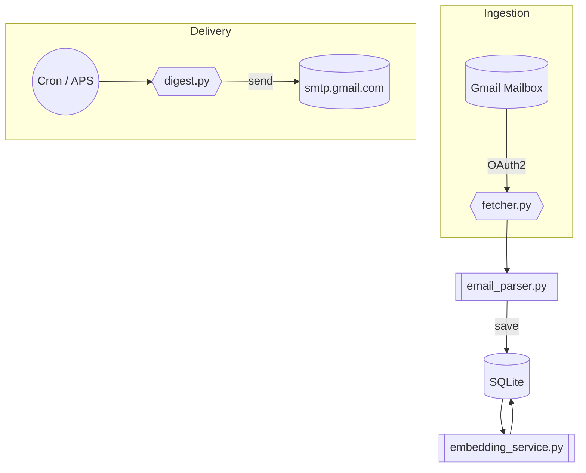

# mailagent

Mailagent is an automated service that fetches e-mails from a mailbox (starting with Gmail for the MVP), indexes their content into a lightweight knowledge-base, and delivers scheduled digests to subscribed users.

---

## 1. Problem & Motivation

Even simple mailing lists and newsletters can quickly overwhelm an inbox.  Valuable information ends up scattered, duplicated, or lost entirely.  Mailagent centralises inbound content and turns it into an organised, searchable knowledge-base.  Users receive concise, periodic summaries instead of a constant stream of noise.

## 2. MVP Scope

```
Source-Mail ▶︎ Knowledge-Base ▶︎ Weekly Digest
```

1. **Single mailbox (Gmail)**  
   • Authenticate via OAuth2 ("Gmail API" preferred over raw IMAP)  
   • Pull new messages, starting from the most recent 30 days  
2. **Parse & store**  
   • Extract plain-text / HTML body, subject, date, sender  
   • Persist messages in a simple database (SQLite for speed of setup)  
3. **Index**  
   • Generate semantic embeddings (OpenAI or local model) and store alongside metadata  
   • Build rudimentary search endpoint (keyword + vector)  
4. **Digest generation**  
   • On a weekly schedule compile unread / new messages  
   • Summarise (LLM) and e-mail a markdown / HTML digest to each subscriber  
5. **Subscription management**  
   • Minimal CLI or REST endpoint to add / remove e-mail addresses  

## 3. Tech Stack

| Layer | MVP Choice | Rationale |
|-------|------------|-----------|
| Language | Python 3.12+ | Batteries-included, rich e-mail/IMAP libs |
| Mail API | Gmail REST v1 | OAuth2, avoids IMAP quirks |
| Database | SQLite (📦 `sqlite3` / `sqlmodel`) | Zero-config, file-based |
| Vector DB | SQLite FTS5 + in-table embeddings | Keep infra minimal |
| Scheduling | `apscheduler` | Simple cron-like jobs |
| Summarisation | Gemini 2.0 Flash | Quick, high-quality |
| Web/API | FastAPI | Async-friendly, docs out-of-box |
| Agent Framework | Pydantic-ai | Ease of use, type-safety |

_All of the above can be swapped later (e.g., PostgreSQL + pgvector, Outlook IMAP, etc.)._

## 4. High-Level Architecture



## 5. Roadmap

1. 🔑 Set up Google Cloud project & OAuth credentials
2. 📨 Implement mailbox fetcher (Gmail API)  
   • Incremental sync storing `historyId` to avoid duplicates
3. 🗄️ Design SQLite schema (messages, embeddings, subscribers, digests)
4. ✍️ Integrate OpenAI embeddings & summarisation
5. 🛠️ FastAPI endpoints: health, search, subscribe, unsubscribe
6. 🕑 Weekly APS job → generate & e-mail digest
7. ⚙️ CLI scripts for local dev (bootstrap DB, backfill inbox, run scheduler)
8. 🚀 Dockerfile & fly.io / render.com deployment recipe

## 6. Stretch Goals

• Outlook & generic IMAP integrations  
• Web UI with search, tagging, and smart filters  
• Multi-tenant DB / user auth  
• Advanced ranking (RRF, semantic clusters)  
• Daily / custom frequency digests  

---

### Contributing
1. Install **uv**:
   ```bash
   curl -LsSf https://astral.sh/uv/install.sh | sh  # macOS/Linux
   # Windows (PowerShell)
   # irm https://astral.sh/uv/install.ps1 | iex
   ```
2. Install dependencies:
   ```bash
   uv sync
   ```
1. Copy `.env.example` → `.env` and fill secrets
2. Run `make dev` to start API + scheduler in hot-reload mode

Pull requests welcome!
